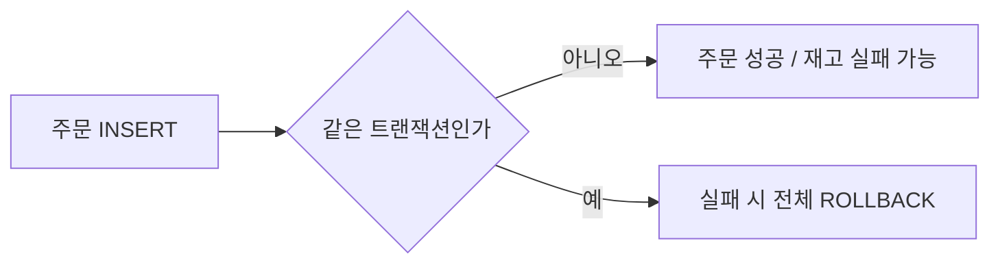
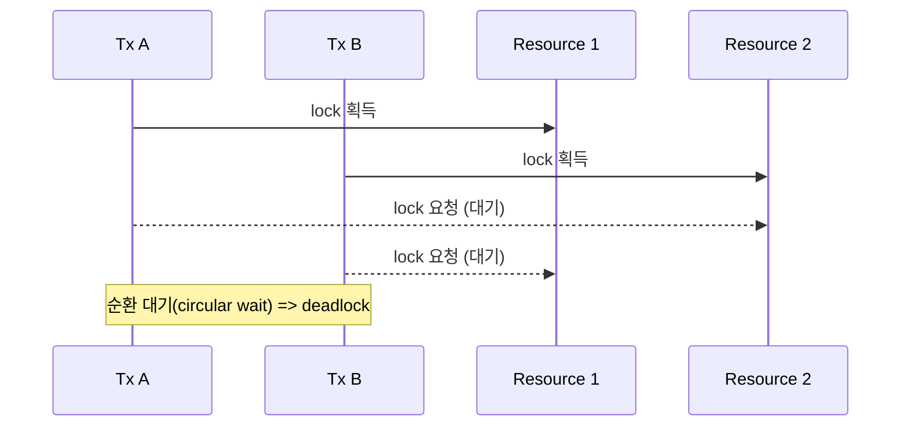
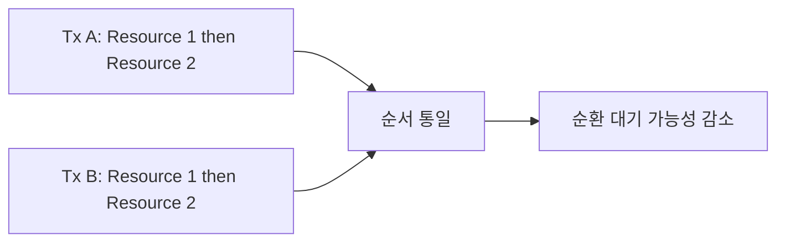
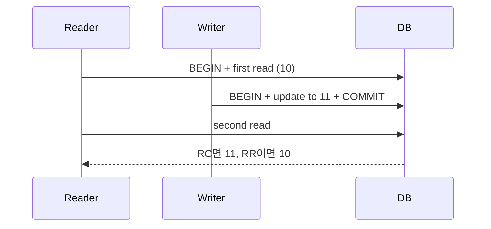

---
title: "데이터가 틀리지 않게 만드는 법: 트랜잭션과 동시성 핵심 정리"
date: 2026-02-18
categories: [database, learning]
tags: [transaction, acid, isolation, lock, deadlock, mvcc, postgresql]
draft: false
source_note: "notes/3-db-foundations.md"
---

# 데이터가 틀리지 않게 만드는 법: 트랜잭션과 동시성 핵심 정리

백엔드에서 DB를 공부할 때 초반에 가장 많이 놓치는 지점은 성능보다 정합성이다.
느린 시스템은 개선할 수 있지만, 틀린 데이터는 복구 비용이 훨씬 크다.
이 글에서는 정합성을 지키기 위해 반드시 알아야 할 핵심을 사례 중심으로 정리한다.
여기서 말하는 정합성은 "데이터가 비즈니스 규칙과 모순되지 않는 상태"를 의미한다.

특히 주문, 결제, 재고처럼 "돈과 수량"이 걸린 도메인에서는
한 번의 정합성 사고가 장애 처리, 데이터 보정, 고객 신뢰 하락으로 바로 이어진다.
그래서 성능 튜닝보다 먼저, "틀리지 않게 만드는 구조"를 먼저 잡는 것이 중요하다.

## 1. 왜 트랜잭션 경계가 먼저인가

트랜잭션은 여러 SQL을 하나의 작업 단위로 묶어 "전부 성공 또는 전부 실패"를 보장하는 경계다.
이 경계가 깨지면, 주문은 저장됐는데 재고는 차감되지 않는 식의 부분 성공이 발생한다.



같은 업무를 분리해서 실행했을 때와, 하나의 트랜잭션으로 묶었을 때 결과 차이는 크다.

- 분리 실행(잘못된 방식): 주문 저장은 성공했지만 재고 차감이 실패하면 주문/재고 상태가 어긋난다. 즉, 부분 성공이 발생한다.
- 단일 트랜잭션(올바른 방식): 재고 차감이 실패하면 주문 저장도 함께 롤백되어 데이터 일관성이 유지된다.

핵심은 단순하다. 업무적으로 한 작업이면 DB에서도 하나의 트랜잭션으로 처리해야 한다.

실무에서 자주 쓰는 문장으로 바꾸면 이렇다.
"같이 성공해야 하는 SQL은 같이 커밋하고, 하나라도 실패하면 같이 롤백한다."

## 2. ACID를 실무에 바로 적용하는 관점

ACID는 암기용 약어가 아니라 설계 체크리스트다.

- Atomicity: 중간 성공 금지
- Consistency: 제약조건과 비즈니스 불변식 유지
- Isolation: 동시 요청 간섭 차단
- Durability: 커밋된 변경의 보존

실무 사고는 대체로 `Atomicity`와 `Isolation`이 약할 때 발생한다.
즉, 경계가 잘못되거나, 동시에 처리되는 요청이 서로의 판단을 오염시키는 경우다.

ACID를 실무 점검 질문으로 바꾸면 더 잘 적용된다.
1. Atomicity: 실패 시 정말로 모두 원복되는가?
2. Consistency: 제약조건과 비즈니스 규칙이 함께 지켜지는가?
3. Isolation: 동시 요청이 서로의 계산 근거를 오염시키지 않는가?
4. Durability: 커밋 후 장애가 나도 결과가 보존되는가?

## 3. 격리수준을 왜 알아야 하나

격리수준은 "얼마나 강하게 서로를 분리할지"를 고르는 다이얼이다.
강하게 설정할수록 안전성은 올라가지만, 대기시간과 처리량 비용이 늘 수 있다.

| 수준 | 특징 | 실무 느낌 |
|---|---|---|
| Read Uncommitted | 커밋 전 변경까지 읽을 수 있음(Dirty Read 가능) | 정합성 위험이 커서 실무 사용은 매우 드묾 |
| Read Committed | 커밋된 값만 읽음 | 기본 선택지로 많이 사용 |
| Repeatable Read | 트랜잭션 내 조회 일관성 강화 | 재조회 일관성 중요할 때 유리 |
| Serializable | 직렬 실행에 가까운 강한 보호 | 안전하지만 비용 큼 |

같은 시나리오로 비교하면 훨씬 이해가 쉽다.
1. 초기 재고는 1개다.
2. 사용자 A와 B가 거의 동시에 구매를 누른다.
3. 구현이 느슨하면 둘 다 `stock=1`을 먼저 읽고 결제 로직으로 들어갈 수 있다.

자주 나오는 잘못된 구현 패턴(읽고-검사하고-수정 분리):

```sql
SELECT stock FROM inventory WHERE product_id = 1;
-- 앱 코드에서 stock > 0 체크
UPDATE inventory SET stock = stock - 1 WHERE product_id = 1;
```

| 수준 | A/B 동시 구매 시 실제로 보이는 현상 | 운영에서 해야 할 일 |
|---|---|---|
| Read Committed | 두 트랜잭션이 모두 `stock=1`을 읽을 수 있어, 구현이 느슨하면 중복 차감/초과 판매가 발생할 수 있다. | `SELECT` + `UPDATE`를 분리하지 말고 `UPDATE ... WHERE stock > 0` 같은 원자적 갱신으로 처리 |
| Repeatable Read | 같은 트랜잭션 안에서는 읽은 값이 흔들리지 않지만, 쓰기 충돌 시 대기 후 한쪽이 실패할 수 있다. | 실패를 예외가 아닌 정상 흐름으로 두고 retry/idempotency 설계 |
| Serializable | DB가 순차 실행과 같은 결과를 강제해 정합성은 가장 높다. 대신 충돌 구간에서는 abort(트랜잭션 중단/롤백)가 늘 수 있다. | 전체가 아닌 핵심 트랜잭션에만 선택 적용 |

중요한 점은 "격리수준을 높이면 실패가 사라진다"가 아니라,
"충돌을 더 명확하게 실패로 드러내고 안전하게 재시도하게 만든다"는 것이다.

참고로 DB 엔진마다 지원 방식이 다르다. 예를 들어 PostgreSQL은 `Read Uncommitted`를 별도로 동작시키지 않고 사실상 `Read Committed`처럼 처리한다.

정답은 "항상 최고 강도"가 아니다.
실무에서는 기본값을 유지하되, 충돌이 잦은 핵심 트랜잭션에만 격리수준을 선택적으로 높이는 접근이 더 현실적이다.

예를 들어 조회 위주의 화면 API는 `Read Committed`로 충분한 경우가 많고,
중복 차감이나 중복 결제가 치명적인 구간은 더 강한 격리/락 전략을 함께 적용한다.

## 4. 락과 데드락: 피할 수 없으면 통제해야 한다

락은 정합성을 지키기 위한 최소한의 제어 장치다.
문제는 락을 잡는 순서가 제각각이면 데드락이 발생한다는 점이다.

대표적인 데드락 패턴:
1. 트랜잭션 A는 자원 1을 잠근 뒤 자원 2를 기다린다.
2. 동시에 트랜잭션 B는 자원 2를 잠근 뒤 자원 1을 기다린다.
3. 서로가 서로를 기다리며 멈춘다.



따라서 같은 종류의 작업은 락 획득 순서를 통일하는 것이 가장 기본적인 예방책이다.



운영 원칙:
1. 같은 종류의 작업은 같은 순서로 잠근다.
2. 트랜잭션을 짧게 유지한다.
3. 데드락은 "언젠가 발생"한다고 가정하고 재시도 정책을 둔다.

즉, 데드락을 "없애는" 접근보다 "발생해도 안전하게 회복하는" 접근이 더 현실적이다.

## 5. MVCC: 읽기와 쓰기를 동시에 살리는 방식

MVCC는 `Multi-Version Concurrency Control`의 약자다.
핵심은 "같은 행(row)을 한 버전으로 덮어쓰지 않고, 버전 관점으로 다룬다"는 점이다.
그래서 읽기와 쓰기가 동시에 일어나도 불필요한 블로킹을 줄이면서 일관성을 유지할 수 있다.

MVCC를 동작 관점에서 짧게 정리하면 다음과 같다.
1. 트랜잭션이 시작되면, 읽기 기준점(snapshot)이 정해진다.
2. 읽기는 그 기준점에서 보이는 버전만 조회한다.
3. 쓰기는 기존 버전을 즉시 파괴하지 않고, 새 버전을 만든다(커밋 후 가시화).
4. 더 이상 참조되지 않는 오래된 버전은 나중에 정리된다.

실제 저장을 단순화해서 보면, 한 행이 아래처럼 "버전 2개"로 존재할 수 있다.

| 버전 | stock 값 | created_by_tx | deleted_by_tx | 커밋 이후 가시성 |
|---|---:|---:|---:|---|
| v1 | 10 | 100 | 200 | 오래된 snapshot에는 보일 수 있음 |
| v2 | 11 | 200 | null | 최신 snapshot에서 보임 |

예시 흐름:
1. 처음에는 `v1(stock=10)`만 존재한다.
2. `Tx 200`이 업데이트하면 `v1`을 바로 덮어쓰는 대신 `v2(stock=11)`를 만든다.
3. 어떤 트랜잭션은 시작 시점(snapshot)에 따라 `v1`을 보고, 다른 트랜잭션은 `v2`를 본다.

PostgreSQL 관점에서는 각 튜플에 `xmin/xmax` 같은 메타데이터를 두고,
"이 버전이 내 snapshot에 보이는가"를 판정한다.



중요한 포인트는 "같은 트랜잭션 안의 재조회 결과"가 격리수준에 따라 달라진다는 점이다.

- READ COMMITTED:
조회 시점마다 최신 커밋 데이터를 본다.
- REPEATABLE READ:
트랜잭션 시작 시점의 snapshot을 기준으로 읽기 때문에, 같은 트랜잭션 내 재조회 결과가 안정적으로 유지된다.

참고로 격리수준의 세부 동작은 DB 엔진마다 차이가 있으므로, 운영 DB 기준으로 문서와 실측을 함께 확인하는 것이 안전하다.

즉, MVCC를 이해하면 다음 질문에 답할 수 있게 된다.
1. 왜 같은 API를 연속 호출했는데 읽는 값이 달라졌는가?
2. 왜 읽기 성능을 살리면서도 일관성을 유지할 수 있는가?
3. 왜 락을 줄였는데도 쓰기 충돌은 여전히 발생하는가?

여기서 자주 생기는 오해도 정리해두면 좋다.
1. MVCC가 있으면 락이 필요 없다는 오해: 읽기 블로킹을 줄여줄 뿐, 쓰기 충돌 제어는 여전히 필요하다.
2. 격리수준을 높이면 모든 문제가 해결된다는 오해: 정합성은 애플리케이션 로직, 제약조건, 재시도 정책까지 포함해 설계해야 한다.
3. MVCC가 공짜라는 오해: 버전 정리 지연이 누적되면 성능/저장공간 문제가 생길 수 있다.

## 6. 정합성 지표 예시

정합성은 "느낌"이 아니라 지표로 봐야 운영이 가능하다.
아래는 실제 결과값이 아니라, 팀에서 바로 적용할 수 있는 예시 형태다.

| 지표 | 의미 | 예시 기준 |
|---|---|---|
| rollback_rate | 전체 트랜잭션 중 롤백 비율 | 5분 평균이 평소 대비 급증하면 점검 |
| deadlock_count | 데드락 발생 횟수 | 분당 0 유지, 발생 시 알람 |
| lock_wait_p95_ms | 락 대기 95퍼센타일 | 임계치 초과 시 쿼리/트랜잭션 길이 점검 |
| consistency_error_count | 앱 레벨 정합성 검증 실패 건수 | 0 유지, 1건이라도 즉시 원인 분석 |

예시 리포트 포맷:

```text
[정합성 주간 리포트]
- rollback_rate: 0.8% (정상 범위)
- deadlock_count: 3 (알람 발생, 재시도 성공)
- lock_wait_p95_ms: 180ms (경계값 접근)
- consistency_error_count: 0 (정상)
```

이런 포맷을 미리 정해두면, 장애가 발생했을 때 "무엇을 먼저 확인할지"가 명확해진다.

지표는 수집보다 대응 규칙이 더 중요하다. 예를 들면 다음처럼 단순하게 시작할 수 있다.
1. `consistency_error_count > 0` 이면 즉시 장애 등급으로 분류하고 신규 배포를 잠시 중단한다.
2. `deadlock_count`가 평소 대비 급증하면 최근 쿼리 변경과 락 획득 순서를 우선 점검한다.
3. `lock_wait_p95_ms`가 임계치를 넘으면 긴 트랜잭션과 hot row를 먼저 찾는다.

## 7. 결론

이번 글의 결론은 한 문장으로 정리된다.
"정합성은 트랜잭션 경계, 격리수준, 락 전략, MVCC 이해가 함께 맞물릴 때 지켜진다."

여기까지 이해하면 다음 질문으로 넘어갈 준비가 된다.
- SQL은 DB 내부에서 어떤 경로(파서/옵티마이저/실행기)로 처리되는가?
- 같은 쿼리라도 실행계획이 왜 달라지는가?

다음 글에서는 데이터 모델링과 SQL 실행 원리를 중심으로,
"왜 느린지"를 감이 아니라 근거로 설명하는 단계로 들어간다.

