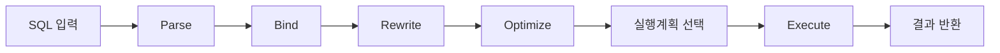
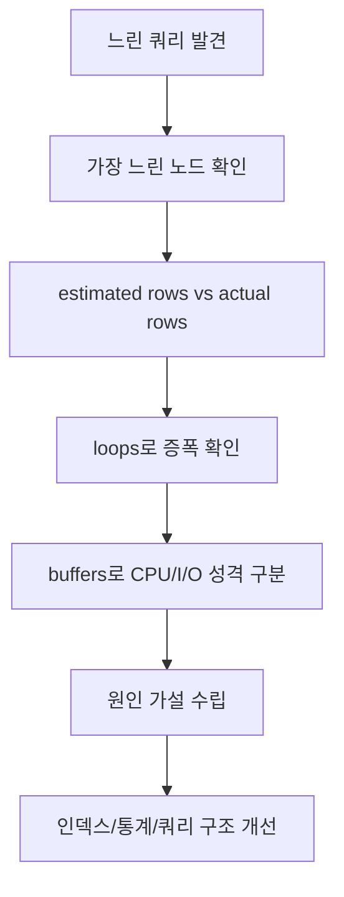

---
title: "왜 인덱스가 있어도 느릴까: SQL 실행 원리와 실행계획 읽기"
date: 2026-02-19
categories: [database, learning]
tags: [sql, optimizer, explain-analyze, query-plan, postgresql]
draft: false
source_note: "notes/3-db-foundations.md"
---

# 왜 인덱스가 있어도 느릴까: SQL 실행 원리와 실행계획 읽기

DB를 처음 공부할 때 가장 자주 나오는 질문이 있다.
"인덱스만 만들면 쿼리는 무조건 빨라지지 않나요?"

결론은 아니다.
인덱스는 성능을 높일 가능성을 키워주지만, DB는 데이터 분포와 비용을 계산해 때로는 전체 훑기(Seq Scan)를 더 유리하다고 판단한다.
그래서 핵심은 인덱스 유무 자체보다, DB가 왜 그 실행 경로를 선택했는지 근거를 읽어내는 것이다.
이 글의 개념 설명과 실습 예시는 PostgreSQL 기준으로 작성했다.

## 인덱스의 역할과 한계

인덱스는 책의 "목차"와 비슷하다.
목차가 있으면 원하는 페이지를 빠르게 찾을 수 있듯, 인덱스가 있으면 조건에 맞는 행을 더 빨리 찾을 가능성이 높아진다.

다만 목차를 만든다고 책 내용이 줄어드는 것은 아니듯, 인덱스도 공짜가 아니다.
인덱스가 많아질수록 쓰기(INSERT/UPDATE/DELETE) 비용과 저장공간 사용량이 늘어난다.
또한 조건에 맞는 데이터가 너무 많으면, 인덱스를 타는 것보다 전체를 읽는 방식이 더 유리할 수 있다.

성능 이슈를 다룰 때는 실행 시간 숫자만 보고 판단하기 쉽다.
"5ms로 줄었네, 해결!"처럼 결과값만 확인하고 끝내면, 왜 빨라졌는지에 대한 근거가 남지 않는다.
문제는 재현성이다. 느림의 원인은 대체로 한 가지가 아니라, 여러 요인이 겹쳐서 나타난다.

대표적인 원인:
- 데이터 분포
- 통계정보 신선도
- 조건 선택도(조건에 걸리는 행의 비율)
- 정렬/조인 방식

## 인덱스가 있어도 느릴 수 있는 이유

인덱스가 있어도 항상 이득인 것은 아니다. DB는 "무조건 인덱스"가 아니라 "비용이 낮은 경로"를 고른다.
예를 들어 조건에 맞는 데이터가 너무 많다면, 인덱스로 여기저기 접근하는 것보다 한 번에 전체를 읽는 편이 더 싸게 계산될 수 있다.

자주 나오는 상황을 표로 정리하면 아래와 같다.

| 상황 | 왜 느려질 수 있나 | 흔한 오해 |
|---|---|---|
| 조건 선택도가 낮음(걸리는 행이 많음) | 인덱스 랜덤 접근 비용이 커짐 | 인덱스가 있으면 무조건 빠르다 |
| 테이블이 작음 | 전체 스캔 자체가 빠름 | Seq Scan은 항상 나쁘다 |
| 통계정보가 오래됨 | 옵티마이저가 rows를 잘못 추정 | 쿼리 문장만 고치면 해결된다 |
| 정렬/조인 비용이 큼 | 스캔보다 후속 단계가 병목 | 스캔 노드만 바꾸면 끝난다 |

## SQL은 내부에서 어떻게 실행될까

SQL 실행 흐름은 단순하게 보면 다음 5단계다.
엔진마다 내부 단계의 명칭이나 구현 방식은 조금씩 다를 수 있지만, 분석 관점에서는 같은 틀로 이해해도 무리가 없다.

1. Parse: 문법과 객체를 검사
2. Bind: 타입/스키마 정보 연결
3. Rewrite: 내부 규칙 기반으로 쿼리 재작성
4. Optimize: 후보 경로 비용 계산 후 계획 선택
5. Execute: 선택된 계획 실행



성능 관점에서 가장 중요한 단계는 `Optimize`다.
같은 SQL이라도 데이터 분포나 통계 상태가 달라지면 다른 계획이 선택될 수 있다.
여기서 말하는 통계정보는 "특정 값이 얼마나 자주 나오는지" 같은 분포 정보다.
옵티마이저는 이 통계로 `estimated rows`를 계산하고, 그 추정치를 바탕으로 스캔/조인/정렬 경로를 선택한다.
통계가 오래되면 rows 추정이 틀어져 잘못된 계획이 선택될 가능성이 커진다.

## 실행계획이란 무엇인가

실행계획은 DB가 SQL을 처리하기 위해 만든 "작업 순서표"다.
어떤 테이블을 먼저 읽는지, 어떤 방식으로 읽는지(Seq Scan/Index Scan), 어떤 정렬/조인을 적용하는지가 트리 형태로 표현된다.

실행계획을 보면 다음 질문에 답할 수 있다.
1. DB는 왜 이 경로를 선택했나?
2. 느린 구간은 어디서 발생했나?
3. 수정 후 무엇이 바뀌었나?

즉 실행계획은 결과 보고서가 아니라, 원인을 설명하는 근거 문서다.

## 실행계획은 어디부터 읽어야 할까

`EXPLAIN`은 "예상 계획(추정치)"만 보여주고, `EXPLAIN ANALYZE`는 쿼리를 실제 실행해 "실측값(actual)"까지 보여준다.
그래서 원인 분석 단계에서는 보통 `EXPLAIN (ANALYZE, BUFFERS)`를 사용한다.

처음에는 항목을 많이 볼 필요 없다. 아래 5가지를 우선 본다.

| 항목 | 의미 | 해석 포인트 |
|---|---|---|
| node type | Scan/Join/Sort 같은 작업 종류 | 어떤 종류의 일이 병목인지 |
| estimated rows | 옵티마이저 예상 행 수 | 추정의 출발점 |
| actual rows | 실제 처리 행 수 | 예상과 실제 차이 확인 |
| loops | 노드 반복 횟수 | 작은 오차가 증폭되는 지점 |
| buffers (hit/read) | `hit`: shared_buffers(메모리) 적중, `read`: 디스크에서 실제 읽기 | CPU 중심인지 I/O 중심인지 |

간단한 읽기 순서는 이렇게 잡으면 된다.

1. 가장 시간이 큰 노드를 찾는다.
2. 그 노드의 `estimated rows` vs `actual rows` 차이를 본다.
3. `loops`가 큰지 확인해 오차 증폭 여부를 본다.
4. `buffers`에서 hit/read 비율로 병목 성격을 본다.



## 실습 예시: 인덱스 전/후 비교

아래 수치는 한 번의 실습 예시다.
환경과 데이터량에 따라 절대값은 달라질 수 있다.

실험 조건(예시):
1. 이벤트 로그 테이블에 약 25만 건 데이터를 준비
2. 조회 조건 고정: `user_id=42`, `event_type='checkout'`, 최신순 정렬, `LIMIT 50`
3. 같은 쿼리를 인덱스 전/후로 각각 실행해 실행계획과 시간을 비교

테스트 쿼리:

```sql
SELECT id, user_id, event_type, created_at
FROM app_events
WHERE user_id = 42
  AND event_type = 'checkout'
ORDER BY created_at DESC
LIMIT 50;
```

측정 절차:
1. 인덱스가 없는 상태에서 `EXPLAIN (ANALYZE, BUFFERS)` 실행
2. `(user_id, event_type, created_at DESC)` 복합 인덱스 추가
3. 동일 조건으로 baseline/candidate를 각각 5회 반복 실행
4. 실행시간은 중앙값(median) 기준으로 비교

인덱스 추가 쿼리:

```sql
CREATE INDEX idx_app_events_user_type_created_desc
ON app_events (user_id, event_type, created_at DESC);
```

반복 측정 실행시간(ms):
- baseline: 10.350, 9.973, 10.297, 10.132, 10.793
- candidate: 0.083, 0.070, 0.073, 0.073, 0.071
- 참고: candidate 첫 실행에서는 `buffer read=4`가 관찰됐고, 이후 반복에서는 `read=0`으로 수렴했다(캐시 워밍 영향).

| 구분 | plan node | execution time median(ms) | actual rows | loops | buffer hit | buffer read |
|---|---|---:|---:|---:|---:|---:|
| 인덱스 없음 | Parallel Seq Scan -> Gather Merge | 10.297 | 50 | 1 | 3408 | 0 |
| 인덱스 추가 후 | Index Scan | 0.073 | 50 | 1 | 54 | 0 |

중앙값 기준으로 실행 시간은 약 141배 개선됐다(10.297ms -> 0.073ms).
핵심은 "빨라졌다"에서 멈추지 않고, "왜 빨라졌는지"를 계획으로 설명할 수 있다는 점이다.

해석 요약:
1. 인덱스 없음: 조건에 맞는 행을 찾기 위해 넓은 범위를 읽고 정렬 비용까지 부담했다. 이 구간에서 PostgreSQL은 약 25만 건 데이터 조건에서 `Parallel Seq Scan -> Gather Merge`를 선택해 병렬로 범위를 처리했다.
2. 인덱스 추가 후: 조건과 정렬 순서에 맞는 경로를 바로 타면서 읽기 범위가 크게 감소했다.
3. 결과적으로 처리 경로가 단순해지고 실행 시간이 크게 줄었다.

## 성능 튜닝에서 자주 나오는 실패 패턴

| 실패 패턴 | 왜 문제가 되나 | 개선 방향 |
|---|---|---|
| 실행시간만 보고 결론 | 원인 없는 처방이 됨 | 실행계획과 함께 기록 |
| 인덱스를 무작정 추가 | 쓰기 비용/유지비 증가 | 조회 패턴 기준으로 설계 |
| 통계 상태를 확인하지 않음 | 잘못된 계획 선택 가능 | ANALYZE/자동통계 점검 |
| 한 번의 결과만 신뢰 | 재현성 부족 | 전/후 같은 조건으로 반복 검증 |

## 바로 적용할 수 있는 점검 체크리스트

1. 느린 쿼리는 항상 `EXPLAIN (ANALYZE, BUFFERS)`로 기록한다.
2. `estimated rows`와 `actual rows` 차이를 먼저 본다.
3. `loops`가 큰 노드는 우선 점검한다.
4. `hit/read` 분포로 병목 성격을 구분한다.
5. 인덱스 추가 전후를 같은 쿼리, 같은 조건으로 비교한다.
6. 결과는 "수치 + 실행계획 변화 + 해석" 세 가지를 함께 남긴다.

## 마무리

이 글의 핵심은 단순하다.
인덱스는 중요한 도구지만, 성능의 정답 그 자체는 아니다.
결국 성능 분석의 출발점은 "실행계획을 읽는 습관"이다.
옵티마이저는 문법이 아니라 비용 모델로 실행 경로를 고른다.
후속 글에서는 인덱스 내부 구조(B-Tree, 복합/커버링 인덱스)와 조인 방식(Nested Loop / Hash Join / Merge Join)을
"언제 어떤 방식이 선택되는지"와 "실무에서 어떻게 읽어야 하는지" 중심으로 이어서 정리할 예정이다.

