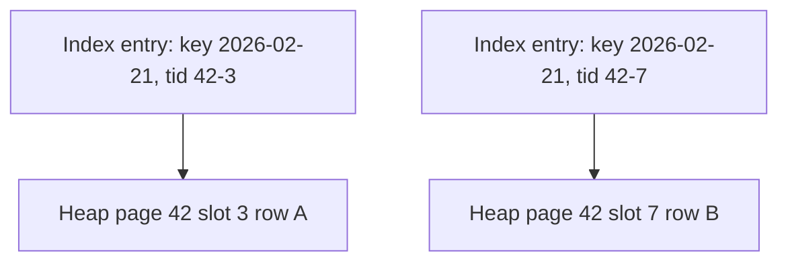
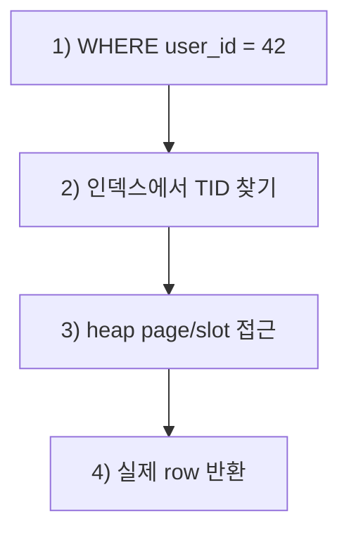
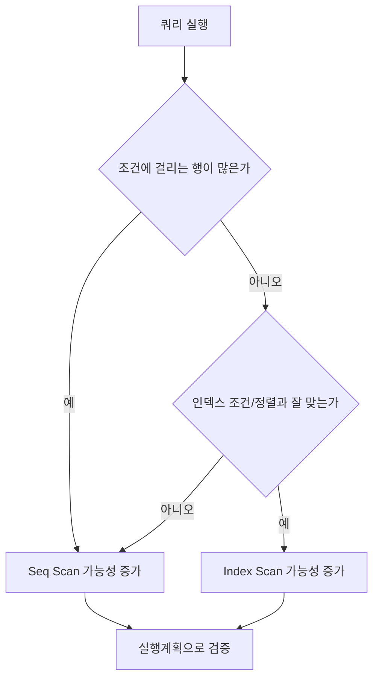
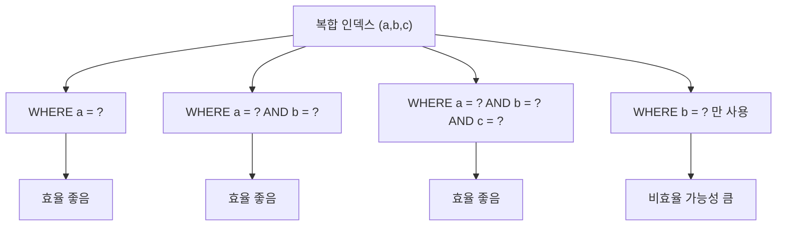

---
title: "트리는 아는데 인덱스는 왜 어려울까: 페이지·블록·슬롯으로 다시 보는 B+Tree"
pubDatetime: 2026-02-21T00:00:00.000Z
categories: [database, learning]
tags: [postgresql, index, btree, b-plus-tree, explain-analyze, database-basics]
draft: false
description: "B-Tree/B+Tree가 어려운 이유를 트리 기초부터 다시 풀고, page/block/slot/TID를 연결해 인덱스 동작을 쉽게 설명한다."
source_note: "notes/3-db-foundations.md"
---

인덱스를 공부하다 보면 어느 순간 이해가 갑자기 멈추는 구간이 생긴다.
트리 개념은 익숙한데, DB 맥락으로 들어오면 갑자기 어렵게 느껴진다.

이 글은 그 지점에서 다시 시작한다.
이진트리 공식부터 외우는 방식이 아니라,
"DB는 무엇을 최소화하려고 B+Tree를 쓰는가?"라는 질문에서 출발한다.

먼저 용어 4개를 정리한다.

- `페이지(page)`: DB가 데이터를 읽고 쓰는 기본 단위
- `블록(block)`: 디스크에 저장된 페이지를 가리키는 단위(번호로 구분)
- `슬롯(slot)`: 페이지 안에서 몇 번째 row 위치인지 나타내는 번호
- `heap`: 실제 row 본문이 저장된 테이블 영역

이 네 가지를 먼저 맞추면, B+Tree 설명의 핵심 흐름은 아래 세 문장으로 요약된다.

1. B+Tree는 "비교 횟수"보다 "페이지 단위로 읽고 쓰는 횟수(I/O)"를 줄이기 위해 설계된 구조다.
2. 인덱스는 실제 데이터 본문이 아니라 `key -> 위치(TID)`를 들고 있다.
3. 그래서 조회는 보통 `인덱스 탐색 -> 테이블 본문(heap) 조회`의 2단계로 동작한다.

이 글의 설명과 예시는 PostgreSQL 관점으로 작성했다.

## 1. 왜 트리 개념을 아는데도 B+Tree가 어렵게 느껴질까

보통 이 지점에서 이해가 멈춘다.

- 트리는 "노드-간선"으로 배웠는데, DB는 갑자기 "페이지"를 말한다.
- `block`, `slot`, `ctid` 같은 낯선 단어가 같이 나온다.
- "인덱스가 빠르다"와 "인덱스가 오히려 느릴 수 있다"가 동시에 등장한다.

이게 헷갈리는 이유는 "틀린 개념"이라서가 아니다.
같은 트리라도 보는 관점이 바뀌기 때문이다.

- 알고리즘 관점: 값을 어떻게 빨리 찾는가
- DB 관점: 디스크/메모리에서 데이터를 몇 번 읽고 쓰는가
- 운영 관점: 통계/실행계획 기준으로 어떤 경로가 선택되는가

같은 트리 개념이라도 DB에서는
"탐색 구조 + 저장 단위 + 실행 경로"를 함께 봐야 해서 난도가 올라간다.
그래서 순서를 분리해서 이해하는 것이 중요하다.

1. 트리: 높이가 낮을수록 탐색이 유리하다.
2. 저장구조: DB는 페이지 단위로 읽고 쓴다.
3. 인덱스: B+Tree 리프에서 위치를 찾고, 실제 row는 테이블 본문(heap)에서 읽는다.

결국 같은 "트리"를 보더라도 DB에서는 "어디에 저장돼 있고, 몇 번 읽는가"까지 함께 봐야 한다.

## 2. 트리, B-Tree, B+Tree는 무엇이 다를까

이 구간에서 잡아야 할 차이는 단순하다.

1. 일반 트리: "부모-자식 구조"라는 큰 틀 이해
2. B-Tree: 검색을 빠르게 하려고 규칙을 강하게 준 트리
3. B+Tree: DB 인덱스에 맞게 내부/리프 역할을 더 분리한 트리

| 개념 | 의미 | 핵심 포인트 |
|---|---|---|
| 트리(Tree) | 부모-자식으로 연결된 일반 계층 구조 | 규칙이 자유롭다 |
| B-Tree | 균형을 유지하는 다갈래 검색 트리 | 노드에 여러 키/자식을 둔다 |
| B+Tree | DB 인덱스에서 널리 쓰는 형태 | 내부는 길 안내, 데이터 위치는 리프에 집중 |

### 일반 트리 (규칙 자유)

```text
      Root
      /  \
     A    B
    /
   C
```

### B-Tree (균형 다갈래)

```text
            [30 | 70]
         /      |      \
    [10|20]  [40|55] [80|90]
```

### B+Tree (리프에 위치 정보 + 리프 연결)

```text
            [30 | 70]
         /      |      \
   [10,20]  [40,55]  [80,90]   <- leaf (key + TID)

Leaf link: [10,20] -> [40,55] -> [80,90]
```

B+Tree를 한 문장으로 요약하면 아래와 같다.

> 정렬된 키를 페이지 단위로 나눠 저장하고, 루트에서 리프까지 내려가며 위치를 찾는 균형 다갈래 트리

실무 관점에서 보면, 값을 빠르게 찾기 위해 "중간 안내판(내부 노드)"과 "최종 주소록(리프 노드)"을 분리한 트리다.

여기까지는 트리 구조 자체의 차이를 봤다.
이제부터는 이 구조가 DB의 실제 주소 체계(page/block/slot)와 어떻게 연결되는지 본다.

## 3. 노드, 페이지, 블록, 슬롯은 무엇이 다른가

이 구분이 선행되면, 뒤에 나오는 인덱스 설명이 자연스럽게 이어진다.

1. `페이지(page)`
   - DB가 디스크/메모리를 다루는 최소 단위다.
   - PostgreSQL 기본 페이지 크기는 보통 8KB다.
2. `블록(block)`
   - 디스크에 저장된 페이지를 가리키는 단위다.
   - `ctid=(42,3)`에서 `42`는 block 번호다.
3. `슬롯(slot)`
   - 페이지 안에서 "몇 번째 행 위치인지"를 가리키는 번호다.
   - `ctid=(42,3)`에서 `3`이 slot 번호다.
4. `노드(node)`
   - B+Tree의 논리 단위다.
   - 실무에서는 보통 "노드 1개 = 인덱스 페이지 1개"로 저장된다.

여기서 `TID`(Tuple ID)는 "행의 물리 주소"를 나타내는 값으로, 보통 `(block, slot)` 형태다.

그림으로 먼저 보면:



같은 내용을 텍스트로 표현하면:

```text
Heap Page #42
┌─────────────────────────┐
│ Header                  │
├─────────────────────────┤
│ Slot #1 -> Tuple A      │
│ Slot #2 -> Tuple B      │
│ Slot #3 -> Tuple C      │  <- ctid offset = 3
├─────────────────────────┤
│ Tuple data area         │
└─────────────────────────┘
```

즉 `ctid=(42,3)`은
"42번 페이지의 3번 슬롯에 있는 row"라는 물리 주소다.

핵심 흐름은 한 문장으로 정리된다.
"인덱스는 key로 TID를 찾고, TID로 실제 row를 찾는다."

## 4. 조회는 실제로 어떻게 움직일까: `key -> TID -> 테이블 본문(heap)`

먼저 가장 단순한 쿼리 하나만 놓고 흐름을 따라가 보자.

```sql
SELECT id, created_at
FROM app_events
WHERE user_id = 42;
```

위 쿼리를 실행할 때 DB 내부에서는 대략 다음 순서가 일어난다.

1. `WHERE user_id = 42` 조건을 인덱스로 탐색한다.
2. 조건에 맞는 TID 목록(주소)을 얻는다.
3. TID가 가리키는 heap 페이지/슬롯으로 이동해 실제 row를 읽는다.

예를 들어 인덱스 결과가 아래처럼 나왔다고 가정하면:

| key (user_id) | TID | 실제 row 위치 |
|---|---|---|
| 42 | (42,3) | heap page 42, slot 3 |
| 42 | (42,7) | heap page 42, slot 7 |

동작 흐름은 이렇게 된다.



같은 원리로, 실무에서 자주 보는 복합 조건 + 정렬 + LIMIT 쿼리도 처리된다.

```sql
SELECT id, user_id, event_type, created_at
FROM app_events
WHERE user_id = 42
  AND event_type = 'checkout'
ORDER BY created_at DESC
LIMIT 50;
```

B+Tree 인덱스가 `(user_id, event_type, created_at DESC)`로 있다면,
아래 순서로 보면 이해가 쉽다.

1. 먼저 `user_id = 42`에 해당하는 구간으로 바로 이동한다.
2. 그 구간 안에서 `event_type = 'checkout'`인 항목만 고른다.
3. 이미 `created_at DESC` 순서가 맞춰져 있으므로, 위에서부터 50개 주소(TID)를 가져온다.
4. 그 주소(TID)가 가리키는 테이블 본문(heap) row를 읽어 결과를 만든다.

예를 들어 인덱스 리프가 아래 순서라면:

| user_id | event_type | created_at (DESC) | TID |
|---|---|---|---|
| 42 | checkout | 2026-02-21 10:00 | (42,7) |
| 42 | checkout | 2026-02-20 21:30 | (42,3) |
| 42 | checkout | 2026-02-19 09:10 | (43,5) |

`LIMIT 2`면 위에서부터 2개 TID, 즉 `(42,7)`, `(42,3)`만 따라가서 row를 읽는다.

즉 인덱스는 "결과 데이터"를 저장하는 곳이 아니라,
"결과 데이터의 위치"를 빠르게 찾게 해주는 주소록에 가깝다.

그 다음 단계에서 DB는 "그 row를 어떤 방식으로 읽을지"를 결정한다.
이때 나오는 용어가 `scan`이고, DB에서 `scan`은 "테이블에서 row를 읽는 방식"을 뜻한다.

대표적으로 두 가지가 자주 나온다.

| 방식 | 뜻 | 언제 자주 유리한가 |
|---|---|---|
| `Index Scan` | 인덱스로 주소를 찾은 뒤 필요한 row만 읽음 | 조건에 맞는 row가 적을 때 |
| `Seq Scan` | 테이블 본문(heap)을 앞에서부터 순서대로 읽으며 조건 확인 | 조건에 맞는 row가 많거나 테이블이 작을 때 |

PostgreSQL에서 `Seq Scan`은 인덱스를 먼저 타지 않고 heap 페이지를 직접 순차 읽기하는 경로다.
즉, `Seq Scan`은 "느린 나쁜 방식"이 아니라 상황에 따라 더 싼 방식이다.

## 5. 인덱스가 있어도 왜 전체 스캔(Seq Scan)이 나올까

많이 오해하는 지점이다.
인덱스가 있으면 무조건 빠른 것이 아니라,
DB가 계산한 비용이 더 낮은 경로가 선택된다.

Seq Scan이 선택되는 대표 상황:

1. 조건 선택도가 낮아(조건에 걸리는 비율이 높아) 인덱스 이점이 작을 때
2. 테이블이 작아서 전체 훑기가 더 쌀 때
3. 통계가 부정확해 옵티마이저 추정이 틀어질 때



핵심은 이 문장이다.

> 인덱스는 "항상 빠른 구조"가 아니라 "적게 읽게 해줄 때 빠른 구조"다.

## 6. 인덱스를 늘리면 왜 쓰기가 느려질까

읽기 성능을 높이는 대가가 쓰기 비용이다.
핵심은 "쓰기 1건이 내부에서 1번 일하는 것이 아니라 여러 번 일한다"는 점이다.

`INSERT/UPDATE/DELETE` 시에는:

1. 테이블(row) 변경
2. 관련 인덱스 엔트리 변경
3. 필요 시 페이지 분할(split)과 부모 갱신
4. 로그(WAL) 기록

이 과정을 함께 수행한다.
그래서 인덱스가 많을수록 쓰기 비용이 커진다.

작업별로 보면 차이가 더 분명하다.

| 작업 | 내부에서 추가로 일어나는 일 | 느려지는 대표 이유 |
|---|---|---|
| `INSERT` | 새 row 저장 + 관련 인덱스들에 새 엔트리 추가 | 인덱스 개수만큼 추가 쓰기 발생 |
| `UPDATE` (인덱스 컬럼 변경) | 기존 인덱스 엔트리 정리 + 새 엔트리 추가 | 사실상 삭제+추가에 가까운 비용 |
| `UPDATE` (비인덱스 컬럼 변경) | 주로 row 변경 중심 | 상대적으로 인덱스 부담이 작음 |
| `DELETE` | row 삭제 표시 + 인덱스 엔트리 정리 | 즉시 파일 축소가 아니라 정리 비용 누적 |

예를 들어 `orders` 테이블에 인덱스가 3개(`PK`, `user_id`, `created_at`)라면,
주문 1건 INSERT 시 DB는 보통 아래 일을 함께 처리한다.

1. heap(테이블 본문)에 row 저장
2. 인덱스 3개에 각각 엔트리 추가
3. 변경 내용을 WAL에 기록

즉 "행 1개 추가"처럼 보여도 실제 내부 쓰기는 그보다 더 많다.

특히 문자열 키가 길거나 가변 길이일수록
인덱스 페이지 밀도가 떨어져 유지비가 더 커질 수 있다.
랜덤하게 분포하는 키는 페이지 분할(split) 가능성을 높여 쓰기 비용을 더 키울 수 있다.

여기서 `WAL`은 장애 복구를 위해 DB가 변경 내용을 먼저 기록하는 로그를 뜻한다.

split이 생기는 이유도 함께 본다.
인덱스 페이지는 고정 크기(예: 8KB)이고, 리프 페이지에는 정렬된 `key + TID`가 들어간다.
새 키가 들어오면 "정렬 순서상 들어가야 할 위치"에 삽입해야 하는데,
그 페이지에 남은 공간이 없으면 한 페이지에 더 넣을 수 없다.
이때 페이지를 둘로 나누는 작업이 split이다.

```text
삽입 전 (가득 참)
[10,20,30,40]

25 삽입 시도 -> 공간 부족

split 후
[10,20]   [25,30,40]
   \        /
  부모 노드 경계값 갱신
```

이 과정에서 비용이 커지는 이유:

1. 기존 페이지 수정 + 새 페이지 생성이 함께 일어난다.
2. 부모 노드 경계값도 갱신해야 한다.
3. 변경 내용이 WAL에도 기록된다.
4. 부모 페이지도 꽉 차 있으면 위로 split이 전파될 수 있다.

그래서 키가 길수록(페이지당 엔트리 수 감소), 그리고 삽입 위치가 랜덤할수록
split이 더 자주 발생해 쓰기 비용이 커지기 쉽다.

실무에서 바로 적용할 최소 원칙은 아래 네 가지다.

1. 조회 패턴이 분명한 인덱스만 유지한다.
2. 비슷한 역할의 중복 인덱스는 정리한다.
3. 긴 문자열을 조인/정렬의 핵심 키로 직접 쓰는지 점검한다.
4. 인덱스 추가 전후에 쓰기 지표(삽입 지연, 업데이트 지연)를 함께 측정한다.

## 7. 인덱스 종류와 복합 인덱스는 어떻게 연결해서 볼까

복합 인덱스로 들어가기 전에, 먼저 "인덱스 종류"를 아주 짧게 정리한다.
실무에서 자주 나오는 기본 맵은 아래와 같다.

| 인덱스 종류 | 주로 유리한 패턴 | 한 줄 메모 |
|---|---|---|
| `B-Tree` | `=`, 범위 조회, 정렬 | 기본 선택지, 대부분 여기서 시작 |
| `Hash` | 동등 비교(`=`) | 범위/정렬에는 부적합 |
| `GIN` | 포함 검색(`jsonb`, array, full-text) | 토큰/원소 기반 검색에 강함 |
| `GiST` | 공간/범위/거리 연산 | 특수 연산자 클래스 기반 |
| `BRIN` | 초대형 테이블의 구간 요약 검색 | 작고 가볍지만 정밀도는 낮을 수 있음 |

이번 글의 중심은 `B-Tree`이고, 복합 인덱스도 B-Tree 문맥에서 이해하면 된다.

복합 인덱스가 `(a,b,c)`면 이 순서대로 정렬된다.
그래서 `a` 없이 `b`만으로는 시작점을 빠르게 좁히기 어렵다.



| 조건 | 효율 |
|---|---|
| `a = ?` | 좋음 |
| `a = ? AND b = ?` | 좋음 |
| `a = ? AND b = ? AND c = ?` | 좋음 |
| `b = ?`만 | 비효율 가능성 큼 |

이 규칙 때문에 인덱스 설계에서 컬럼 순서가 성능을 결정한다.

## 8. 실습 예시: 선택도와 쓰기 비용 비교

여기까지 개념을 봤다면, 이제 "실제로 그런지"를 숫자로 확인해보면 된다.
이번 글에서는 같은 데이터로 3가지를 직접 측정했다.
실습에서는 `app_events`라는 이름의 실습용 테이블을 사용했다.

먼저 데이터 분포부터 보면:

| event_type | 건수 | 비율 |
|---|---:|---:|
| `view` | 240,000 | 80% |
| `purchase` | 57,000 | 19% |
| `checkout` | 3,000 | 1% |
| 합계 | 300,000 | 100% |

### 실험 A: 선택도가 높은 조회

쿼리:

```sql
SELECT id, user_id, event_type, created_at
FROM app_events
WHERE user_id = 101
  AND event_type = 'checkout'
ORDER BY created_at DESC
LIMIT 50;
```

결과(5회 반복 median):

| 케이스 | 실행계획 핵심 노드 | 실행시간 |
|---|---|---|
| 복합 인덱스 없음 | `Seq Scan` | 12.001ms |
| `(user_id, event_type, created_at DESC)` 인덱스 추가 | `Bitmap Heap Scan` | 1.329ms |

약 `9.03배` 개선됐다.
즉, 조건을 많이 줄여주는 인덱스는 실제로 읽는 양을 줄여준다.

### 실험 B: 선택도가 낮은 조회

쿼리:

```sql
SELECT id, user_id, event_type, created_at, payload
FROM app_events
WHERE event_type = 'view';
```

이 실험은 `event_type` 인덱스가 있는 상태에서 실행했다.

결과:

| 항목 | 값 |
|---|---|
| 실행계획 핵심 노드 | `Seq Scan` |
| 실행시간 | 29.721ms |
| 실제 읽은 row | 240,000건 |

여기서 실험 A와 실험 B의 실행시간을 직접 비교하면 안 된다.

1. 실험 A는 조건이 좁고 `LIMIT 50`이 있어 반환 row가 작다.
2. 실험 B는 `view` 240,000건을 반환하고 `payload`까지 함께 읽는다.

즉, 두 실험의 시간 차이는 "인덱스 유무"만의 차이가 아니라
"조건 선택도와 반환 데이터 양" 차이가 크게 반영된 결과다.

핵심은 단순하다.
인덱스가 있어도 읽어야 할 비율이 너무 크면, 전체를 순서대로 읽는 편이 더 싸질 수 있다.

### 실험 C: 인덱스 개수와 쓰기 비용

같은 20,000건 INSERT를 두 테이블에 비교했다.

1. 인덱스 최소 테이블
2. 보조 인덱스 3개가 있는 테이블

결과(5회 반복 median):

| 케이스 | 실행시간 |
|---|---|
| 인덱스 최소 | 45.932ms |
| 보조 인덱스 3개 | 93.316ms |

약 `2.03배` 느려졌다.
즉 읽기를 위해 인덱스를 늘리면, 쓰기에서는 그만큼 유지 비용을 지불한다.

전체 결과는 아래 표로 정리할 수 있다.

| 실험 | 비교 | 핵심 결과 | 해석 |
|---|---|---|---|
| A (선택도 높음) | 인덱스 없음 vs 복합 인덱스 | `12.001ms -> 1.329ms` (`9.03배` 개선) | 인덱스가 읽는 범위를 강하게 줄여줌 |
| B (선택도 낮음) | `event_type='view'` 조회 | `Seq Scan`, 240,000건 읽음 | 읽어야 할 비율이 크면 순차 읽기가 유리할 수 있음 |
| C (쓰기 비용) | 인덱스 최소 vs 보조 인덱스 3개 | `45.932ms -> 93.316ms` (`2.03배` 느림) | 인덱스 유지 작업이 쓰기 비용으로 반영됨 |

이 섹션의 핵심은 한 줄이다.

> 인덱스는 "있으면 무조건 좋다"가 아니라, "읽기 이득과 쓰기 비용을 같이 비교해야 하는 구조"다.

## 9. 참고 자료: B+Tree 시각화와 실행계획 도구

글만으로 이해가 어려울 때는 애니메이션 기반 도구가 도움이 된다.

1. B+Tree 시각화
   - <https://www.cs.usfca.edu/~galles/visualization/BPlusTree.html>
2. B-Tree 시각화
   - <https://www.cs.usfca.edu/~galles/visualization/BTree.html>
3. 실행계획 시각화(PostgreSQL)
   - <https://explain.dalibo.com/>

## 마무리

이 글에서 실제로 가져가면 좋은 기준은 두 가지다.

1. 이 인덱스가 읽는 양(페이지/row)을 충분히 줄여주는가
2. 그 이득이 쓰기 유지비 증가를 감당할 만큼 큰가

결국 인덱스 설계는 "구조를 외우는 문제"보다
"실행계획과 실측 수치로 선택하는 문제"에 가깝다.

다음 글에서는 `Index Scan`과 `Index Only Scan`을 비교해
어떤 조건에서 heap 접근이 줄어드는지 먼저 정리한다.
이어지는 글에서는 조인 노드(Nested Loop / Hash Join / Merge Join)를
실행계획 관점에서 어떻게 읽고 판단할지 다룰 예정이다.
