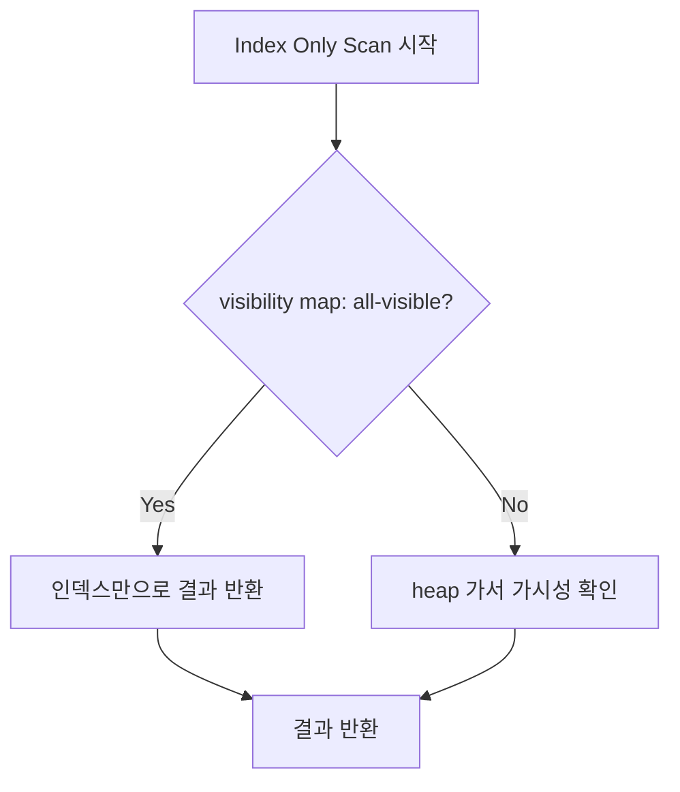

---
title: "인덱스만 읽는다면서 왜 느릴까: Heap Fetches와 visibility map으로 보는 Index Only Scan"
pubDatetime: 2026-02-24T00:00:00.000Z
categories: [database, learning]
tags: [postgresql, index-scan, index-only-scan, heap-fetches, visibility-map, explain-analyze]
draft: false
description: "Index Scan과 Index Only Scan의 차이를 covering index와 visibility map 관점에서 풀고, Heap Fetches가 성능에 미치는 영향을 실측으로 정리한다."
source_note: "notes/3-db-foundations.md"
source_session: "sessions/2026-02-24.md"
---

인덱스를 공부하다 보면 실행계획에서 `Index Only Scan`이 뜨면 안심하게 된다.
"인덱스만으로 결과를 만든다"는 이름이니, 당연히 빠를 거라고 기대한다.

그런데 실제로 covering 인덱스를 추가했더니 실행 시간이 오히려 늘어나는 경우가 있다.
이름은 분명히 "더 좋은 경로"인데, 숫자는 반대다.

이 글은 그 지점에서 시작한다.
`Index Scan`과 `Index Only Scan`이 실제로 무엇이 다른지,
그리고 같은 `Index Only Scan`이라도 왜 성능이 달라지는지를
`Heap Fetches`와 `visibility map` 관점에서 정리한다.

이 글의 설명과 수치는 PostgreSQL 기준으로 작성했다.

## 1. Index Scan과 Index Only Scan은 무엇이 다른가

먼저 두 경로의 차이를 짧게 잡고 가자.

`Index Scan`은 인덱스에서 위치(TID)를 찾고, 테이블 본문(heap)에서 실제 데이터를 읽는 경로다.
인덱스가 가진 정보만으로는 결과를 만들 수 없기 때문에, heap 접근이 기본 동작이다.

`Index Only Scan`은 인덱스 정보만으로 결과를 만들 수 있는 경로다.
다만 "지금 읽어도 되는 데이터인지" 확인이 필요하면 heap을 다시 읽는다.

| 경로 | 인덱스에서 하는 일 | heap 접근 |
|---|---|---|
| `Index Scan` | 위치(TID)를 찾는다 | 반드시 접근 (데이터를 읽어야 하므로) |
| `Index Only Scan` | 위치 + 결과 데이터를 함께 읽는다 (커버링 인덱스일 때) | 가시성 확인이 필요한 경우에만 접근 |

핵심은 `Index Only Scan`이 "heap을 안 읽는 경로"가 아니라,
"heap을 안 읽을 수도 있는 경로"라는 점이다.

그러면 실제로 heap을 얼마나 읽었는지는 어떻게 확인할 수 있을까?
여기서 `Heap Fetches`라는 지표가 등장한다.

## 2. Heap Fetches와 visibility map은 왜 중요한가

`EXPLAIN (ANALYZE, BUFFERS)`를 실행하면 `Index Only Scan` 노드에 `Heap Fetches`라는 항목이 나온다.

이 숫자의 의미는 이렇다.
실행계획 이름은 `Index Only Scan`이지만, 실행 중에 테이블 본문(heap)을 다시 확인한 횟수다.

여기서 구분할 점이 있다.

1. `rows`: 최종 반환 행 수
2. `Heap Fetches`: 실행 중 heap 가시성 확인 횟수

둘은 같은 지표가 아니다.
`rows`는 "결과를 몇 건 돌려줬는가"이고,
`Heap Fetches`는 "결과를 만드는 과정에서 heap을 몇 번 들여다봤는가"다.

예를 들어 `rows=100`인데 `Heap Fetches=200`이라면,
100건을 돌려주기 위해 200번이나 heap을 다시 확인했다는 뜻이다.
이러면 `Index Only Scan`이라는 이름과 달리 실제로는 heap 접근이 많이 일어난 것이다.

그러면 `Index Only Scan`인데 왜 heap을 다시 확인해야 하는 걸까?
이건 PostgreSQL이 데이터를 읽을 때 거치는 가시성 확인과 관련이 있다.

PostgreSQL은 읽을 때 "이 row가 지금 트랜잭션에서 보여도 되는가"를 확인해야 한다.
이 확인을 매번 heap에서 직접 하면 비용이 커진다.
그래서 페이지 단위로 "이 페이지는 재확인 없이 읽어도 되는 상태인가"를 따로 기록해둔다.
이 기록이 `visibility map`이다.



페이지 단위로 보면 이런 그림이다.

```text
[visibility map]
page 10: all-visible = 1  -> heap 안 가도 됨
page 11: all-visible = 1  -> heap 안 가도 됨
page 12: all-visible = 0  -> heap 가서 확인 필요

=> all-visible=0 페이지가 많을수록 Heap Fetches 증가
```

그러면 all-visible 표시는 언제 바뀌는가?

참고로 여기서 나오는 용어를 짧게 정리하면:
- `VACUUM`: 직접 실행하는 정리 명령(죽은 버전 정리 + 가시성 정보 갱신)
- `autovacuum`: PostgreSQL이 자동으로 돌리는 백그라운드 정리 작업

1. `INSERT/UPDATE/DELETE`가 발생하면
   - 해당 페이지의 all-visible 표시가 내려갈 수 있다(`0`).
2. `VACUUM/autovacuum`가 정리한 뒤
   - 해당 페이지를 안전하다고 판단하면 all-visible 표시가 다시 올라갈 수 있다(`1`).

그래서 쓰기 변경이 많은 구간에서는 `Heap Fetches`가 늘고,
정리 작업 이후에는 다시 줄어드는 패턴이 자주 나타난다.

여기까지 개념을 잡았다면, 이제 "실제로 그런지"를 숫자로 확인해보면 된다.

## 3. 실측 비교: 같은 쿼리에서 왜 결과가 달라졌는가

같은 쿼리로 아래 3가지 케이스를 비교했다.

테스트 쿼리:

```sql
SELECT created_at, total_amount
FROM orders_ios
WHERE user_id = 42
  AND status = 'paid'
ORDER BY created_at DESC
LIMIT 100;
```

이 쿼리에서 컬럼 역할은 이렇게 나뉜다.
- 조건/정렬 컬럼(key 후보): `user_id`, `status`, `created_at`
- 결과 반환 컬럼: `total_amount`

인덱스 구성:

```sql
-- baseline: non-covering (total_amount가 인덱스에 없음)
CREATE INDEX idx_orders_ios_key
ON orders_ios (user_id, status, created_at DESC);

-- candidate: covering with INCLUDE (total_amount를 인덱스에 포함)
CREATE INDEX idx_orders_ios_covering
ON orders_ios (user_id, status, created_at DESC)
INCLUDE (total_amount);
```

차이는 `INCLUDE (total_amount)` 하나뿐이다.

비교한 3가지 케이스:
1. baseline(non-covering): `Index Scan`
2. covering 인덱스 + VACUUM 전: `Index Only Scan`
3. covering 인덱스 + VACUUM 후: `Index Only Scan`

결과 요약:

| 케이스 | Node Type | Heap Fetches | Execution Time |
|---|---|---:|---:|
| baseline (non-covering) | Index Scan | - | 0.126 ms |
| candidate (pre-vacuum) | Index Only Scan | 200 | 0.252 ms |
| candidate (post-vacuum) | Index Only Scan | 0 | 0.050 ms |

pre-vacuum 구간에서는 covering 인덱스를 만들었어도 `Heap Fetches=200`이 발생했다.
실행계획 이름은 `Index Only Scan`이지만, 실제로는 heap 재확인이 많이 일어난 것이다.
그래서 baseline의 `Index Scan`(0.126ms)보다 오히려 느린 0.252ms가 나왔다.

`VACUUM (ANALYZE)` 후에는 `Heap Fetches=0`으로 내려갔다.
같은 쿼리, 같은 인덱스인데도 heap 확인이 사라지면서 0.050ms까지 단축됐다.

버퍼 수치도 같이 줄었다.
- baseline: `shared hit=100, read=4`
- pre-vacuum: `shared hit=204`
- post-vacuum: `shared hit=5`

`shared hit=204`에서 `shared hit=5`로 줄었다는 건,
실행 과정에서 접근한 버퍼 페이지 양이 크게 줄었다는 뜻이다.

> 결국 `Index Only Scan`의 성능은 실행계획 이름이 아니라 `Heap Fetches` 수치가 결정한다.

## 4. INCLUDE는 언제 넣고 어디까지 포함해야 하는가

여기까지 보면 "그러면 covering 인덱스를 항상 만들면 되는 거 아닌가?"라는 생각이 든다.
하지만 `INCLUDE`에는 비용이 따른다.

먼저 `covering index`를 짧게 정리하면:
"해당 쿼리에 필요한 컬럼을 인덱스가 모두 가지고 있는 상태"다.

`INCLUDE`는 검색 조건용 컬럼이 아니라,
"결과 반환을 위해 같이 저장해두는 컬럼"에 가깝다.
앞 섹션의 DDL로 보면, key 컬럼(`user_id, status, created_at`)은 "어떻게 찾을지"를 결정하고,
INCLUDE 컬럼(`total_amount`)은 "찾은 뒤 무엇을 바로 반환할지"를 보강한다.

다만 `INCLUDE`는 많이 넣을수록 좋은 옵션이 아니다.

| 측면 | 내용 |
|---|---|
| 장점 | heap 재접근 감소 → 읽기 성능 개선 가능 |
| 비용 | 인덱스 크기 증가 + 쓰기(INSERT/UPDATE/DELETE) 유지 비용 증가 |

실무에서는 "자주 읽는 반환 컬럼만" 제한적으로 넣는 편이 안전하다.
특히 쓰기가 잦은 테이블이라면, INCLUDE로 인한 인덱스 크기 증가가
쓰기 지연과 VACUUM 부하를 함께 키울 수 있다.

## 5. 실무에서 바로 쓸 수 있는 확인 순서

위의 내용을 실무 상황에 적용하면 이 순서가 된다.

1. 쿼리가 covering 조건을 만족하는지 먼저 확인한다.
2. 실행계획에서 `Node Type`과 `Heap Fetches`를 같이 본다.
3. `Heap Fetches`가 높으면 VACUUM 상태를 확인한다.
4. `INCLUDE` 컬럼은 자주 조회되는 반환 컬럼 위주로 최소화한다.
5. 전/후 비교는 단발이 아니라 반복 측정으로 검증한다.

## 마무리

이 글의 핵심은 단순하다.
`Index Only Scan`이라는 이름만 보면 안 되고,
실제로 heap을 얼마나 다시 읽었는지(`Heap Fetches`)를 함께 봐야 한다.
그리고 그 수치를 결정하는 건 `visibility map` 상태다.

`INCLUDE` 컬럼도 마찬가지로,
"많이 넣을수록 좋다"가 아니라 "읽기 이득과 쓰기 비용을 같이 보고 최소한으로 넣는 것"이 기준이다.

다음 글에서는 `INCLUDE` 설계를 조금 더 확장해,
쓰기 부하가 높은 테이블에서 인덱스 크기와 쓰기 지연이 어떻게 변하는지 실측으로 이어서 정리하겠다.

