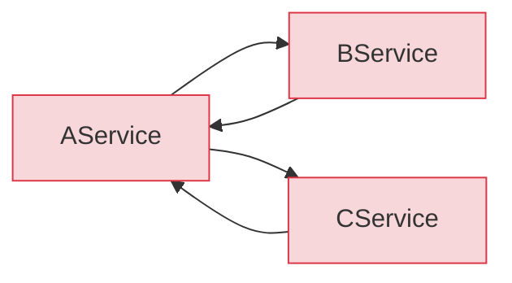
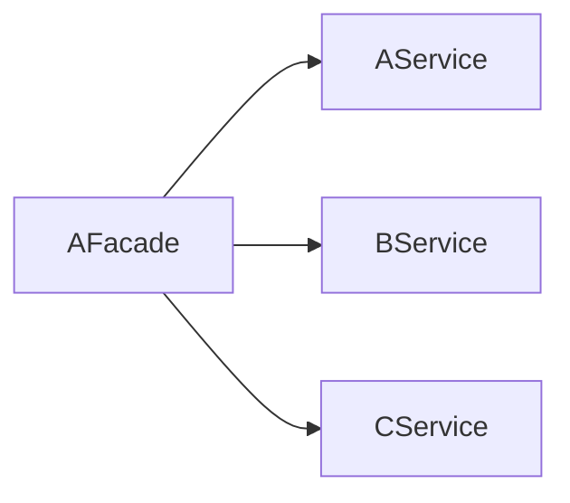
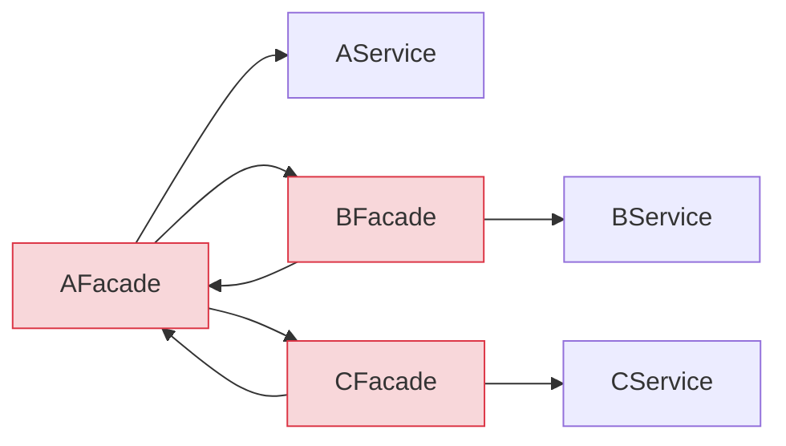
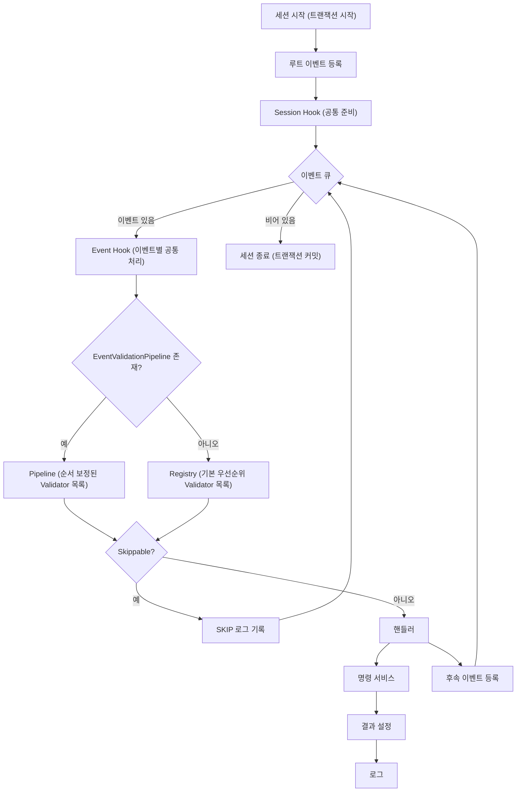

시스템이 작을 때는 `Facade -> Service` 정도의 직선형 흐름으로도 충분하다.
요청이 들어오면 Facade가 받아서 Service를 부르고, 결과를 반환하면 끝이다.

문제는 기능이 늘어나면서 시작된다.
같은 검증과 분기 로직이 여러 곳에 복사되고, 비슷한 Facade와 Service가 늘어나고, 서로를 다시 호출하는 구조가 생긴다.
그 시점부터 변경 영향도는 보이지 않고, 데이터 흐름도 흐려지고, 재사용도 어려워진다.

이 글은 그런 흐름을 어떻게 정리했는지에 대한 기록이다.
직선형 호출 구조에서 시작했지만, 기능이 늘어나면서 같은 규칙이 여러 곳에 퍼지고 흐름이 보이지 않게 됐다.
그래서 행위 기반 이벤트와 세션 루프를 중심으로 실행 오케스트레이션을 다시 설계했다.

## 한 요청이 여러 단계로 이어지는 시스템

모든 요청이 단일 처리로 끝나는 것은 아니다.
특히 운영 효율화를 위해 사람의 개입을 줄이고 싶은 시스템에서는, 한 번의 요청이 내부에서 여러 단계로 이어지는 구조가 자연스럽게 만들어진다.

처음에는 단순했다. 작업을 만들고 끝이었다.
그런데 요구사항이 쌓이면서 "이것도 자동으로 만들어라", "저것도 자동으로 붙여라"는 요청이 계속 추가됐다.
생성뿐 아니라 이동, 상태 변경, 회수까지 전체 라이프사이클을 추적해야 했고, 각 단계마다 연계 작업이 자동 생성되는 구조가 됐다.

결과적으로 이런 흐름이 만들어졌다.

1. 작업 A가 생성된다
2. 조건에 따라 연계 작업 B가 자동으로 붙는다
3. 추가 조건이 충족되면 작업 C도 자동 생성된다
4. 모든 연계 작업이 끝나면 A가 자동 완료된다

요청은 하나지만 내부 처리는 하나로 끝나지 않는다.
이 흐름을 서비스가 서로 직접 호출하는 방식으로 풀면, 구조는 금방 복잡해진다.

## 구조가 무너진 과정

처음부터 복잡했던 것은 아니다. 단계적으로 악화됐다.

### 1단계: Service ↔ Service 직접 호출

초기에는 Facade 없이 Service끼리 직접 호출하는 구조였다.
기능이 적을 때는 문제가 없었지만, 도메인이 늘면서 Service 간 의존이 꼬이기 시작했다.



`AService`가 `BService`를 호출하고, `BService`는 상태를 확인하기 위해 다시 `AService`를 호출한다.
전형적인 순환참조다.

### 2단계: Facade 계층 도입

Service 간 직접 의존을 끊기 위해 Facade 계층을 도입했다.
Facade가 Service를 조합하고, Service끼리는 서로를 모르는 구조다.



이 시점에서는 깔끔했다. Facade가 흐름을 조합하고, Service는 자기 역할만 수행한다.

### 3단계: Facade ↔ Facade 순환

문제는 요구사항이 복잡해지면서 다시 시작됐다.
하나의 Facade가 다른 도메인의 Facade를 호출해야 하는 상황이 생겼고, 결국 Facade 간에도 순환참조가 만들어졌다.



Service 레벨에서 겪었던 문제가 한 계층 위에서 다시 반복됐다.

### 4단계: 우회를 위한 클래스 증식

순환을 피하려고 Facade를 이름만 바꿔서 새로 만들기 시작했다.
`AProcessFacade`, `AHelperFacade` 같은 클래스가 생겼다.
기존 Facade와 역할은 거의 같지만 검증 조건이 한두 개 다르거나, 호출 순서만 다른 클래스였다.

이 시점에서 구조적으로 세 가지가 동시에 무너졌다.

- 같은 검증이 여러 곳에 퍼졌다. 상태 체크, 수량 체크 같은 규칙이 `AFacade`, `AProcessFacade`, `BFacade` 안에 각각 미묘하게 다른 버전으로 복사되어 있었다.
- 흐름이 코드에 흩어져 보이지 않았다. 요청 하나를 처리하려면 어떤 Facade가 어떤 순서로 불리는지 코드를 따라가며 추적해야 했다.
- 변경 영향도를 한눈에 잡을 수 없었다. 검증 규칙 하나를 바꾸면 어디까지 영향이 가는지 확인하기 어려웠다.

핵심은 Facade를 더 만드는 것이 아니라, 같은 규칙을 한 곳에서 다루고 흐름을 한눈에 볼 수 있게 만드는 것이었다.

## 무엇을 해결하고 싶었는가

4단계까지 진행되면서 가장 크게 느낀 것은 흐름이 보이지 않는다는 점이었다.

하나의 API 요청이 들어오면 내부에서 뭘 부르고, 어떤 조건에서 분기하고, 어디서 끝나는지를 코드만으로는 추적하기 어려웠다.
개발자도 헷갈리기 시작하니 버그가 빈번해졌다.
원인을 추적하려면 Facade 호출 체인을 따라가며 하나씩 확인해야 했고, 그 과정 자체가 또 다른 실수를 만들었다.

그래서 하고 싶었던 것은 단순했다.
하나의 API 요청이 진입하는 시점부터 끝나는 시점까지, 내부에서 어떤 흐름으로 이어졌는지를 한눈에 보고 싶었다.
그래야 운영이 가능하다고 판단했다.

이 목표를 위해 세 가지 방향을 정했다.

1. 진입점을 통일한다. 모든 요청이 하나의 게이트웨이를 통과하도록 만든다. Spring의 `DispatcherServlet`이 HTTP 요청의 단일 진입점인 것처럼, 비즈니스 실행도 단일 진입점을 둔다.
2. 타임라인 기반 로그를 만든다. 요청이 어떤 이벤트를 거쳐 어떤 경로로 처리됐는지를 세션 단위로 기록한다.
3. 검증을 비즈니스 로직에서 분리한다. 검증 규칙이 Facade마다 복사되는 문제를 구조적으로 막는다.

## 바뀐 구조: 이벤트 기반 오케스트레이션

직접 호출을 끊고, 이벤트가 큐를 통해 흐름을 이어받는 오케스트레이션 구조로 바꿨다.
참고로 여기서 말하는 오케스트레이션은 분산 시스템의 SAGA 패턴 같은 것이 아니라, 단일 프로세스 내에서 실행 흐름을 제어하는 구조다.

### 핵심 개념

먼저 이 구조를 구성하는 세 가지 개념을 정리한다.

- 세션: 하나의 요청을 처리하는 단위이자, 하나의 DB 트랜잭션 범위다. 루트 이벤트부터 마지막 후속 이벤트까지 단일 커밋으로 처리된다.
- 이벤트 큐: 요청 스코프 내의 인메모리 큐(자료구조)다. Kafka나 Redis 같은 외부 메시지 브로커가 아니다.
- 핸들러: 각 이벤트를 처리하는 단위다. 핸들러는 다음 핸들러를 직접 호출하지 않고, 후속 이벤트를 큐에 넣기만 한다.

### 왜 이 구조인가: 제약이 설계를 결정했다

이 구조는 "이벤트 큐가 좋아서" 선택한 것이 아니다.
아래의 제약 조건들이 설계 선택지를 좁혔고, 그 안에서 가장 합리적인 구조를 찾은 결과다.

단일 API 응답 제약.
화면과 API 스펙이 이미 확정된 상태였다. 하나의 API 요청에 대해, 내부에서 벌어지는 모든 처리 결과를 한 번의 응답에 담아 내려줘야 했다. 비동기로 처리하고 나중에 결과를 폴링하는 방식은 선택지에 없었다.

정합성이 최우선.
이 시스템의 바로 뒷단은 회계였다. 회계 시스템은 처리 결과를 받아서 이동평균 등 원가를 계산하는데, 여기서 한 건이라도 정합성이 틀어지면 그 시점 이후의 회계 데이터가 전부 어긋난다. 복구 비용이 극도로 높은 구조였기 때문에, 부분 성공은 허용할 수 없었다. 전부 성공하거나 전부 실패해야 했다.

인프라 제약.
사용 가능한 인프라는 RDB 하나뿐이었다. Kafka, Redis 같은 외부 브로커는 비용 문제로 도입할 수 없었다. 개발 과정에서는 로그 인프라조차 제한적이어서, 런타임 로그도 RDB에 남기는 구조로 설계해야 했다.

구조적으로 낮은 트래픽.
이 시스템은 설치 인력과 서비스 지역의 물리적 제약으로 트래픽 상한이 명확했다. 하루 처리량이 수십 건 수준이었고, 향후에도 지역 단위로 점진적으로 확장하는 계획이었다. 대규모 트래픽을 전제로 한 비동기 아키텍처는 과설계였다.

이 제약들을 종합하면 선택지는 자연스럽게 좁혀진다.

- 단일 API 응답 -> 동기 처리
- 부분 성공 불허 -> 단일 트랜잭션
- 외부 브로커 없음 -> 인메모리 큐
- 낮은 트래픽 -> 동기 체이닝의 성능 비용이 문제되지 않음

결과적으로 이 구조는 동기적으로 순차 실행되는 인메모리 이벤트 루프 기반 오케스트레이션이다.
"이벤트 큐"라는 이름이 붙어 있지만 Kafka 같은 비동기 메시지 시스템과는 성격이 다르다. 단일 트랜잭션 안에서 실행 흐름을 분리하고, 순환 의존을 끊기 위한 구조적 장치에 가깝다.

트래픽이 크게 늘거나 비동기 처리가 필요해지는 시점이 오면 외부 브로커로 전환할 여지는 열어두되, 현재 상황에서는 과설계를 피하는 쪽을 택했다.

### 운영 안전장치

이벤트 루프 구조는 잘못 설계하면 후속 이벤트가 꼬리를 물며 끝나지 않는 문제가 생길 수 있다.
이 위험을 방치하면 단일 트랜잭션 구조와 결합될 때 장애 반경이 더 커진다.

그래서 게이트웨이에 세션당 최대 루프 횟수 제한을 뒀다.
현재는 30회를 넘기면 자동으로 중단되도록 막아두었고, 이 경우 어디까지 실행됐는지와 왜 종료됐는지를 타임라인 로그로 추적할 수 있다.

실패 로그 보존도 별도로 신경 썼다.
세션 실행은 `try-catch-finally` 구조로 감싸져 있어서, 중간에 예외가 발생해 비즈니스 처리가 실패하더라도 당시까지 수집된 실행 구간과 에러 메시지를 끝에서 남긴다.
덕분에 운영에서는 "어디서 멈췄는지", "무슨 메시지로 실패했는지", "직전까지 어떤 이벤트가 처리됐는지"를 사후 추적할 수 있다.

### 실행 흐름



앞서 예로 든 흐름이 이 구조에서는 이렇게 처리된다.

```text
세션 시작 (트랜잭션 시작)
  └─ [큐] TaskACreateEvent
       ├─ 검증: 상태 체크, 수량 체크
       ├─ 핸들러: 작업 A 생성
       └─ 큐에 등록: TaskBCreateEvent
  └─ [큐] TaskBCreateEvent
       ├─ 검증: 연계 조건 충족 여부
       ├─ 핸들러: 연계 작업 B 생성
       └─ 큐에 등록: TaskACompleteEvent
  └─ [큐] TaskACompleteEvent
       ├─ 검증: 모든 연계 작업 완료 여부
       ├─ 핸들러: 작업 A 완료 처리
       └─ 큐에 등록: 없음
  큐 비어 있음 -> 세션 종료 (트랜잭션 커밋)
```

핵심은 핸들러가 다음 핸들러를 직접 부르지 않는다는 점이다.
`TaskACreateHandler`는 `TaskBCreateEvent`를 큐에 넣기만 하고, 큐가 다음 단계를 이어받는다.
이전 구조에서 Facade끼리 서로를 호출하던 순환 관계가 사라진다.

## 검증을 어떻게 분리했는가

### 검증이 비즈니스 로직보다 긴 문제

이 시스템에서 가장 까다로운 부분은 검증이었다.
하나의 동작에 앞서 돌아야 하는 검증 로직이 10개를 넘는 경우가 흔했다.
비즈니스 로직 자체는 두세 줄이 전부인데, 그 앞을 지키는 검증이 코드의 9할을 차지하는 구조였다.

게다가 검증 조건이 단순하지 않았다.
A 도메인의 상태, B 도메인의 상태, C 도메인의 타입을 한번에 봐야 하는 복합 조건이 대부분이었다.

처음에는 검증을 함수 단위로 나눠봤다.
하지만 함수가 늘어나면서 어떤 순서로 실행되는지, 어떤 조건에서 어떤 함수가 돌아야 하는지가 다시 복잡해졌다.

### 전략 패턴 기반 검증 파이프라인

그래서 검증을 파이프라인처럼 실행하는 구조로 바꿨다.

각 검증 규칙은 `EventValidator` 인터페이스를 구현하는 `@Component`다.
각 Validator는 자기가 처리할 이벤트 타입을 내부에 선언하고 있고, 별도의 Registry가 기동 시점에 `Map<EventType, List<EventValidator>>` 형태로 Validator 목록을 미리 구성해둔다.

게이트웨이는 이벤트가 들어오면 타입을 기준으로 Registry에서 해당 Validator 목록을 꺼내 순서대로 실행한다.

```text
EventValidator (interface)
  ├─ StructureValidator    : 우선순위 STRUCTURE
  ├─ ExistsValidator       : 우선순위 EXISTS
  ├─ StatusValidator       : 우선순위 STATUS
  ├─ PolicyValidator       : 우선순위 POLICY
  └─ OtherValidator        : 우선순위 OTHER

Registry: Map<EventType, List<EventValidator>>
  TaskACreateEvent -> [StructureValidator, ExistsValidator, StatusValidator]
  TaskBCreateEvent -> [ExistsValidator, StatusValidator, PolicyValidator]
```

우선순위는 Enum 기반으로 5단계 정도를 뒀다. `STRUCTURE`, `EXISTS`, `STATUS`, `POLICY`, `OTHER` 같은 식이다.
각 Validator가 자기 우선순위를 선언하면 Registry가 이 순서에 맞춰 정렬한다.

대부분의 경우 이 기본 순서로 충분하다.
하지만 특정 이벤트에서 Validator 실행 순서를 바꿔야 하는 경우가 있다.
그럴 때는 `EventValidationPipeline`을 만든다.

```text
기본: Registry의 우선순위대로 실행
TaskACreateEvent -> Registry -> [Structure -> Exists -> Status]

순서 오버라이드가 필요할 때: Pipeline 생성
TaskACreateEvent -> Pipeline -> [Exists -> Structure -> Status -> Policy]
```

게이트웨이는 해당 이벤트에 Pipeline이 존재하면 Pipeline을 우선 사용하고, 없으면 Registry의 기본 순서로 실행한다.
Pipeline 안에서 Validator 리스트의 순서를 보정할 수 있기 때문에, 기존 Validator 코드를 수정하지 않고도 특정 이벤트의 검증 흐름을 바꿀 수 있다.

이 방식의 장점은 세 가지다.

- 순서를 제어할 수 있다. 기본 우선순위는 Enum으로 선언하고, 예외는 Pipeline에서 보정한다.
- 항상 전부 실행하지 않는다. 이벤트 타입에 따라 필요한 검증만 선택적으로 실행된다.
- 1차 캐시를 활용할 수 있다. 어차피 하나의 트랜잭션 안이므로, 검증 단계에서 조회한 엔티티는 JPA 1차 캐시에 남아 핸들러에서 다시 쿼리하지 않는다.

### Hook: 공통 검증과 정합성 보정의 분리

검증 중에는 이벤트 종류와 무관하게 항상 실행되어야 하는 공통 검증이 있었다.
예를 들어 특정 식별자의 유효성 검증이나 존재 여부 확인 같은 것이다.
이 로직은 상당히 길고, 여러 곳에 파편화되어 있었다.

이런 공통 검증을 각 핸들러에 넣으면 어디에나 동일한 코드가 복사된다.
그래서 세션과 이벤트의 라이프사이클에 맞춰 공통 로직을 끼워넣는 Hook 구조로 분리했다.

- Session Hook: 세션 시작 시 공통 준비와 종료 시 마무리를 담당한다.
- Event Hook: 각 이벤트마다 반복되는 공통 검증과 정합성 보정을 담당한다.

공통 검증은 선언형으로 설계했다.
이벤트가 공통 검증 전용 인터페이스를 상속하고, 그 안에 어떤 조건으로 검증할지를 `conditions`로 선언만 하면 된다.
실행은 Session Hook이 알아서 처리한다. 루트 이벤트일 경우 `sessionBeforeHook`에서 해당 선언을 읽고 검증을 수행하는 구조다.

```text
이벤트가 공통 검증 인터페이스를 상속하고, 조건만 선언한다
interface RequiredIdentifierValidation {
    val conditions: List<ValidationCondition>
}

class TaskACreateEvent(
    ...
) : DomainEvent, RequiredIdentifierValidation {
    override val conditions = listOf(
        ValidationCondition.EXISTS,
        ValidationCondition.STATUS_ACTIVE
    )
}

sessionBeforeHook이 루트 이벤트의 선언을 보고 검증을 실행한다
```

이렇게 하면 공통 검증을 추가하거나 조건을 바꿀 때 핸들러를 건드리지 않아도 된다.
이벤트 클래스에서 선언만 바꾸면 Hook이 나머지를 처리한다.

외부에서 들어오는 데이터의 신뢰도가 높지 않아서, 내부에서 정합성을 맞춰야 하는 로직도 있었다.
이 로직까지 비즈니스 핸들러 안에 들어가면 핸들러의 역할이 흐려진다.
그래서 정합성 보정도 Event Hook 단계에서 처리하도록 추출했다.

### 스킵 처리

운영 중에 이런 요구사항이 들어왔다.
"이미 취소된 것을 다시 취소 요청하면 400 에러를 내리지 말고, 자연스럽게 스킵 처리해달라."

단순해 보이지만 구현은 간단하지 않았다.
검증 단계에서 스킵 판단을 해도, 그 뒤의 비즈니스 로직에서도 스킵 처리가 필요해지기 때문이다.

이 문제를 검증 규칙에 마커 인터페이스(`Skippable`)를 도입해서 풀었다.
검증 단계에서 스킵 대상으로 판단되면 마커를 설정하고, 오케스트레이션 게이트웨이가 이를 확인해서 핸들러 실행 없이 SKIP 상태로 로그만 남기고 다음 이벤트로 넘어간다.

```text
검증 -> Skippable 판정 -> Gateway에서 확인 -> 핸들러 실행 생략 -> SKIP 로그 기록 -> 다음 이벤트
```

이렇게 하면 스킵 로직이 비즈니스 핸들러 안으로 침투하지 않고, 타임라인 로그에도 스킵 사유가 자연스럽게 남는다.

## 새로운 이벤트를 추가할 때

이 구조의 실질적인 장점은 확장할 때 드러난다.

예를 들어, 기존 흐름에 "작업 A 생성 후 검수" 단계가 추가된다고 하면 다음과 같다.

1. `InspectionEvent` 클래스를 만든다
2. 해당 이벤트의 검증 규칙을 등록한다
3. `InspectionHandler`를 구현한다
4. `TaskACreateHandler`에서 후속 이벤트 등록 지점을 `InspectionEvent`로 바꾼다

기존 핸들러의 비즈니스 로직이나 검증 규칙을 수정할 필요는 없다.
변경되는 것은 후속 이벤트 등록 지점 하나뿐이고, 나머지는 오케스트레이션 루프가 자동으로 처리한다.
이전 구조에서는 새로운 단계를 끼워넣으려면 Facade 호출 체인을 전부 추적하고 수정해야 했다.

## 이력과 로그

여기서 가장 헷갈리기 쉬운 부분은 이력 테이블과 런타임 로그다.
둘은 같은 내용을 두 번 저장하는 구조가 아니다.

- 이력 테이블: 다시 조회해야 하는 최종 상태를 남긴다.
- 런타임 로그: 그 상태에 도달한 판단 흐름을 남긴다.

한 줄로 정리하면 이렇다.
이력 테이블은 `최종 상태 + 결과`만 남기고, 런타임 로그는 `어떤 판단으로 그렇게 됐는지`를 남긴다.

| 상황 | 이력 테이블 | 런타임 로그 |
|---|---|---|
| 성공 | 성공 상태와 최종 결과 저장 | 처리 순서, 선택된 핸들러, 후속 이벤트 기록 |
| 스킵 | 스킵 상태와 최종 결과 저장 | 스킵 사유와 중단 지점 기록 |
| 실패 | 실패 상태와 최종 결과 저장 | 실패 위치와 에러 경로 기록 |
| 후속 이벤트 생성 | 최종 상태 저장 | 어떤 이벤트가 다음 이벤트를 만들었는지 기록 |

로그는 JSON 기반으로, 원문 payload를 그대로 남기지 않는다. 필요한 값만 추출하고, 민감한 값은 마스킹 파이프라인을 거쳐 처리한다.

타임라인만으로는 "왜 이 경로를 탔는지"의 판단 근거를 남기기 어려운 경우가 있었다.
그래서 각 구간에서 자유롭게 부가 정보를 남길 수 있는 구조도 함께 만들었다.
게이트웨이가 세션마다 context를 생성하고, 핸들러나 검증 내부에서 `context.log`를 호출하면 최종 JSON의 `contextLog` 필드에 순차적으로 기록된다.

```json
{
  "logger": "OrchestrationLogger",
  "rootEvent": {
    "type": "TaskACreateEvent",
    "snapshot": {
      "eventId": "evt_123",
      "targetId": "tgt_01",
      "actorId": "[masked]"
    }
  },
  "status": "SUCCESS",
  "timeline": [
    {
      "eventName": "TaskACreateEvent",
      "snapshot": { "eventId": "evt_123", "targetId": "tgt_01" },
      "validations": ["ExistsValidator", "StatusValidator"],
      "handler": "TaskACreateHandler",
      "queuedEvents": ["TaskBCreateEvent"]
    },
    {
      "eventName": "TaskBCreateEvent",
      "snapshot": { "eventId": "evt_124", "targetId": "tgt_01" },
      "validations": ["ExistsValidator", "PolicyValidator"],
      "handler": "TaskBCreateHandler",
      "queuedEvents": ["TaskACompleteEvent"]
    },
    {
      "eventName": "TaskACompleteEvent",
      "snapshot": { "eventId": "evt_125", "targetId": "tgt_01" },
      "validations": ["CompletionValidator"],
      "handler": "TaskACompleteHandler",
      "queuedEvents": []
    }
  ],
  "contextLog": [
    "TaskACreateHandler: target resolved to tgt_01",
    "TaskBCreateHandler: linked condition met, auto-creation triggered"
  ]
}
```

이 로그를 보면 하나의 세션 안에서 어떤 이벤트가 어떤 순서로 처리됐고, 각 단계에서 어떤 검증을 통과했으며, 어떤 후속 이벤트를 만들었는지가 한눈에 보인다.
`contextLog`에는 타임라인만으로는 알 수 없는 판단 근거나 부가 정보가 남아서, 디버깅 시 맥락을 빠르게 파악할 수 있다.

## 무엇이 좋아졌고, 무엇이 남았는가

### 개선된 점

- 순환참조가 사라졌다. Facade 간 직접 호출이 없어지고, 모든 흐름이 이벤트 큐를 통해 단방향으로 진행된다.
- 검증 중복이 줄었다. 검증 규칙이 Facade마다 복사되지 않고, Registry와 Pipeline에서 관리된다.
- 흐름이 보이게 됐다. 타임라인 로그를 보면 요청 하나가 어떤 경로로 처리됐는지 바로 파악할 수 있다.

### 실제로 달라진 점

정확한 수치로 환산하기 어려운 부분도 있지만, 운영과 변경 체감은 분명했다.

- Facade 계층은 모두 걷어냈고, 순환을 우회하려고 만들었던 중복 클래스들도 함께 제거했다.
- 예전에는 동일한 동작을 흐름마다 다시 구현하는 경우가 많았지만, 지금은 동작을 이벤트 단위로 분리해 여러 구간에서 재사용할 수 있게 됐다.
- 초창기에는 validation 관련 알림이 거의 매일 들어왔지만, 최근 한 달은 거의 조용했다.
- 예전에는 30개 안팎의 클래스만 바뀌어도 배포 전부터 긴장해야 했는데, 최근에는 300개가 넘는 클래스 변경 이후에도 배포 후 별다른 에러 없이 안정적으로 운영됐다.

### 에러 처리

세션은 단일 트랜잭션이므로, 중간 이벤트에서 실패하면 전체가 롤백된다.
부분 성공은 없다. 앞서 설명한 정합성 제약으로 인해 전체 롤백이 유일한 선택이었다.

롤백이 발생하면 타임라인 로그에 실패 위치와 에러 경로가 기록된다.
운영에서는 이 로그를 기반으로 원인을 파악하고, 필요 시 동일 요청을 재시도하는 방식으로 대응한다.

### 트레이드오프

이 구조가 만능은 아니다. 인식하고 있는 한계는 다음과 같다.

- 트랜잭션이 길어질 수 있다. 후속 이벤트가 많아지면 하나의 트랜잭션이 길어지고, 그만큼 락 점유 시간도 늘어난다. 이를 완화하기 위해 락 획득 시점을 가능한 한 후반부에 배치하는 방식으로 점유 구간을 줄이고 있지만, 규모가 커지면 트랜잭션 분리를 검토해야 한다.
- 동기 체이닝의 한계. 본질적으로 동기적 순차 실행이기 때문에, 병렬 처리가 필요한 상황에서는 구조를 바꿔야 한다.
- 러닝 커브. 이벤트, 핸들러, Validator, Hook, Pipeline 등 개념이 많아서 처음 합류하는 개발자가 전체 구조를 파악하는 데 시간이 걸린다. 이 글을 작성한 이유이기도 하다.
- 루프 상한을 넘는 흐름은 정상 처리 대상이 아니라 설계 이상 신호로 본다. 현재는 30회 제한으로 방어하고 있지만, 이런 케이스가 반복되면 이벤트 분해 방식이나 선행 조건 설계를 다시 봐야 한다.

### 아직 남은 과제

구조를 잡으면서 개선된 부분이 많지만, 매끄럽지 않은 지점도 남아 있다.

이벤트 실행 순서의 명시적 제어.
A 이벤트가 들어왔는데 B 이벤트가 먼저 실행되어야 하는 경우가 있다. 현재는 별도 인터페이스를 통해 선행 이벤트를 선언하는 방식으로 처리하고 있지만, 흐름이 직관적이지 않다. 이벤트 간 의존 관계가 복잡해지면 이 방식의 한계가 드러날 수 있다.

생성 이벤트의 식별 문제.
생성 이벤트는 아직 엔티티가 만들어지기 전이므로, payload에 유니크한 식별자가 없다. 이 때문에 동일 요청의 재시도인지, 별개의 요청인지, 내부에서 중복 호출된 것인지를 명확히 구분하기 어렵다. 현재는 큐에서 이벤트 타입 기준으로 중복을 체크하고 있지만, 이 방식은 벌크 처리와 잘 맞지 않는다. 같은 타입의 이벤트가 여러 건 들어와야 하는 벌크 시나리오에서 타입 기반 중복 체크가 걸림돌이 되기 때문이다.

이 문제들은 현재 운영에 치명적이지는 않지만, 요구사항이 확장되면 구조적으로 풀어야 할 지점이다.

## 마무리

오케스트레이션은 서비스를 순서대로 호출하는 방식이 아니다.
실행 흐름을 보호하고, 비즈니스 규칙을 한곳에 모으고, 순환참조와 중복 구현을 줄이기 위해 둔 통제 경계다.

이 글은 특정 구조를 소개하려는 글이라기보다, 순환 구조와 중복 코드가 커지던 시점에 어떤 기준으로 흐름을 다시 설계했는지를 기록하는 데 더 가깝다.
